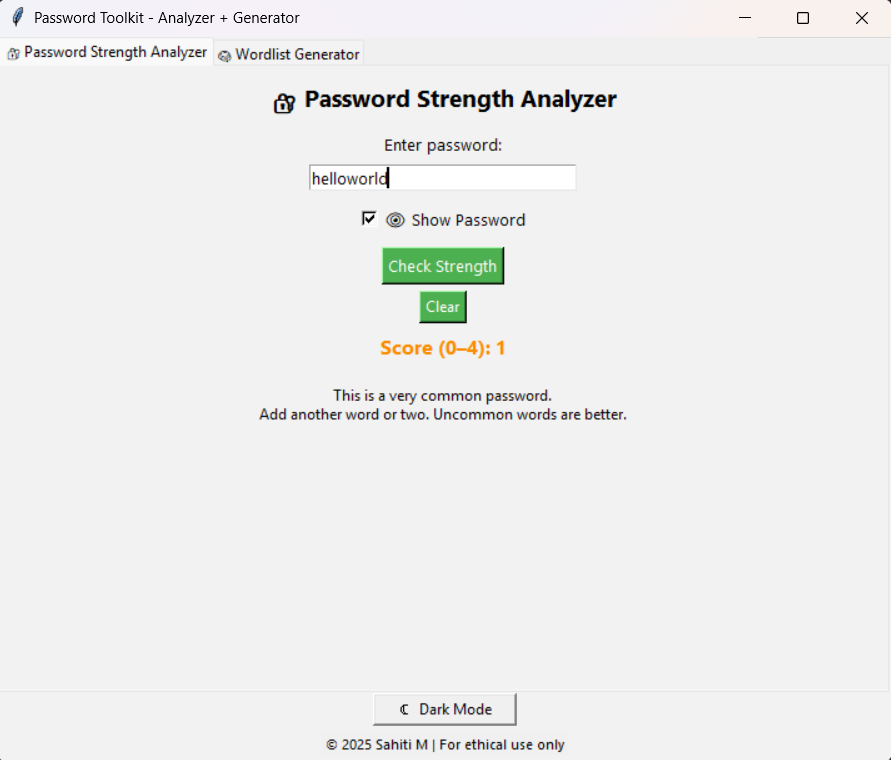
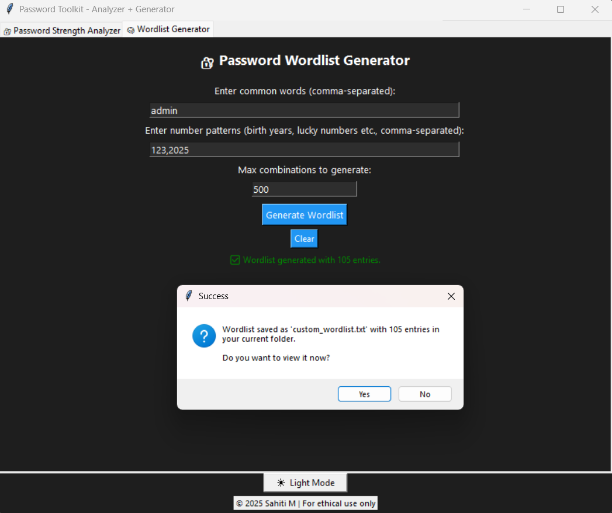
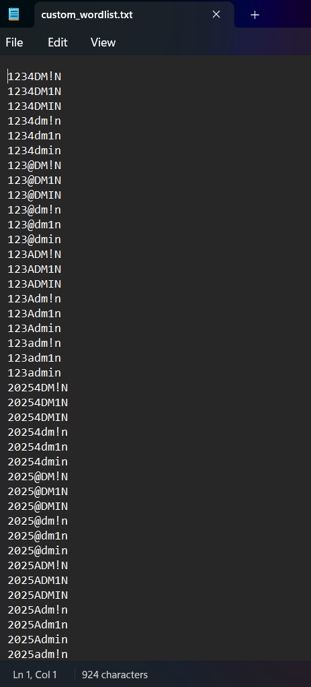

# Password Security Toolkit: Strength Analyzer + Wordlist Generator

## Overview

Weak passwords remain one of the most common causes of account compromise and credential-based attacks. This project combines password strength evaluation and custom wordlist generation into a single GUI-based toolkit for security awareness, password analysis, and controlled security testing.

The toolkit uses the zxcvbn password estimation library to evaluate password strength and generates customized wordlists using common password mutation techniques such as leetspeak substitutions, case variations, and numeric patterns.

Built using Python and Tkinter, the application features a tabbed GUI interface with Light/Dark mode support for an improved user experience.

### Modules Included

- **Password Strength Analyzer** — Evaluates password strength and provides feedback using zxcvbn
- **Custom Wordlist Generator** — Generates password wordlists using leetspeak, case variations, and numeric patterns

---

## Features

- GUI-based password security toolkit with tabbed interface
- Password strength analysis using zxcvbn
- Password weakness feedback and scoring
- Custom wordlist generation for security testing
- Leetspeak-based password mutations
- Case variation and numeric pattern generation
- Dark/Light mode support
- Export generated wordlists to `custom_wordlist.txt`

---

## Tech Stack

- Python
- Tkinter
- zxcvbn

---

## Installation


### 1. Clone the repository or download the `.py` file
```bash
git clone https://github.com/s-a-63/password_analyzer_generator.git
cd Password_Toolkit
```

### 2. Install the required Python package:
```bash
pip install zxcvbn
```

## Running the Toolkit
```bash
python pw_toolkit_gui.py
```

---

## Project Structure

```
📁 Password_Toolkit/
├── pw_toolkit_gui.py              # Combined GUI (tabs)
├── requirements.txt                     # Lists zxcvbn
├── custom_wordlist.txt                  # Output wordlist
├── README.md                            # This file
├── 📁 password_analyzer_gui/            # Standalone password analyzer
│   └── password_analyzer_gui.py
├── 📁 wordlist_generator_gui/           # Standalone wordlist generator
│   └── wordlist_generator_gui.py
└── 📁 screenshots/                      
```

---

## Screenshots

### Password Strength Analyzer



---

### Wordlist Generator



---

### Generated Custom Wordlist



---

## Challenges Faced

- Designing a responsive Tkinter GUI with tab-based navigation
- Managing multiple password mutation combinations efficiently
- Maintaining usability across Light and Dark mode themes
- Generating meaningful password feedback using zxcvbn outputs

---

## Limitations

- Password strength analysis depends on the zxcvbn estimation model
- Generated wordlists are rule-based and do not include probabilistic attack models
- The toolkit is intended for educational and authorized security testing only
- Extremely large mutation combinations may increase generation time and output size

---

## Ethical Use Notice
This tool is for educational, ethical, and awareness purposes only.
Do not use it for unauthorized access or illegal activities.

---

## Author
Sahiti M | All rights reserved
